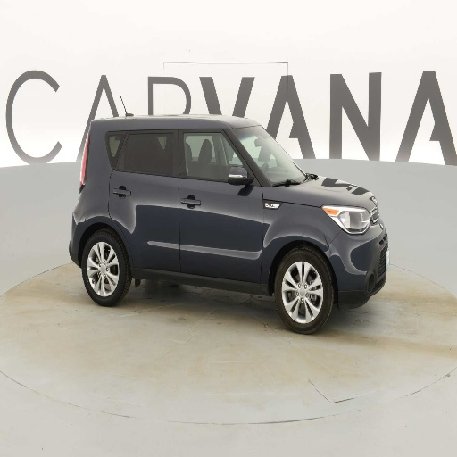
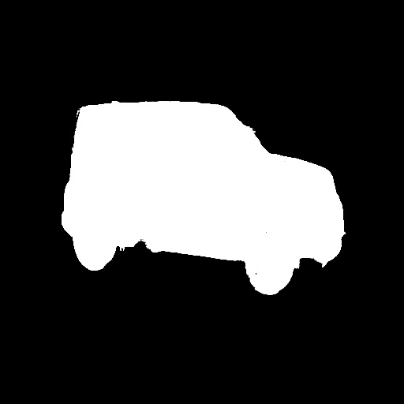
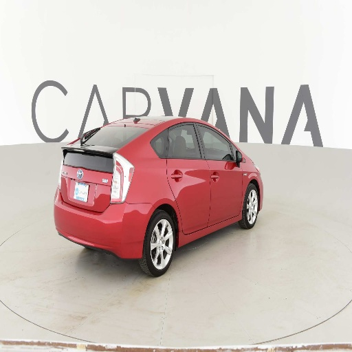
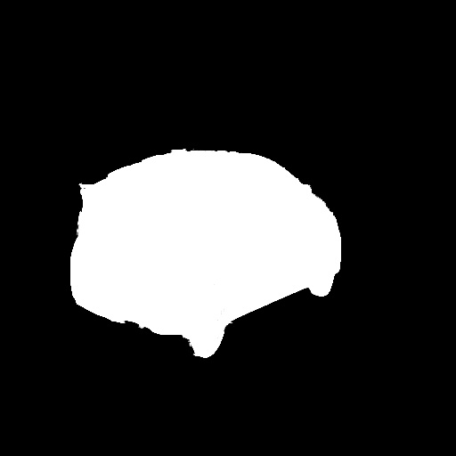
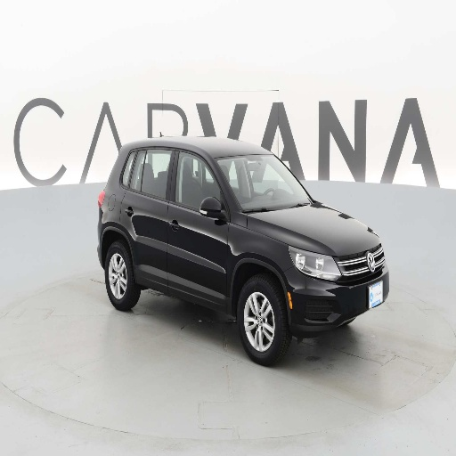
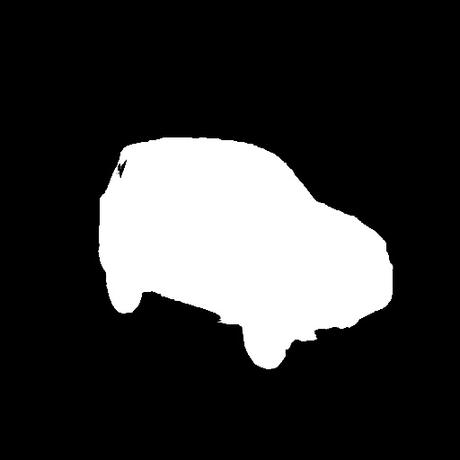
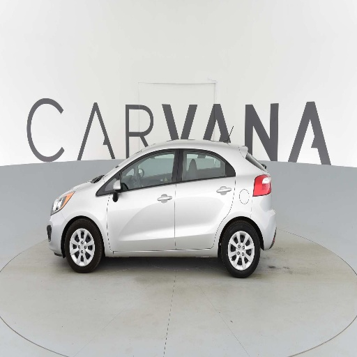
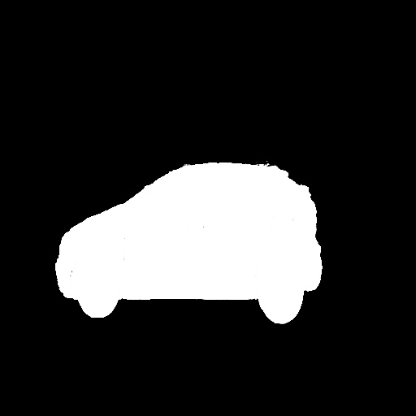

# U-Net

Implementation of U-Net for semantic segmentation in Tensorflow low level api using tf.data pipeline.

# Data

Kaggle's `carvana-image-masking-challenge` dataset is used to perform segmentaion 

/train/ dataset of kaggle is split into 4070 training images and 1018 validation images

## Pre-processing

All the images are resized into 512x512 resolution.

Data transformations such as translation, horizontal flip are used on training data to improve generalization

All preprocessing functions can be found in src/DataPreparation.py

# Architecture

This architecture is inspired from [U-Net: Convolutional Networks for Biomedical Image Segmentation](https://arxiv.org/abs/1505.04597)

Although there are advanced architectures like deeplabv3 for semantic segmentation...U-Net was a breakthrough paper elegantly implementing encoder-decoder architecture for segmentation

For this project, I modified U-Net architecture by introducing batch normalization layers and using padded convolutions so that there is no loss of border pixels..results in a symmetric enoder-decoder architecture

Modified Conv Block: [ Conv(3X3) | BN | ReLu | Conv(3X3) | BN | ReLu ]

Dice loss is used as the loss function 

Model Definitions can be found in src/Model.py

# Usage

 For training:
 
 From src directory run main.py
 
`python main.py --train`

 For inference of single image:
 
`python main.py --predict`

# Results

Training is carried out using batch size of 1 image to account for high resolution(512x512) images to train on Nvidia K80 GPU(11GB Memory). Higher batch size can be used considering memory requirements

Mean_dice_loss over validation set is observed to be 0.0121 i.e. validation error rate of 1.121% after training for 3 epochs using adam optimizer with 0.0001 learning rate. 

Below are the inferences on test images of carvana-dataset

|       test_img                                     |      result                                                      |
|--------------------------------------------------- |   -------------------------------------------------------------  |
| |      |
| |      |
| |      |
| |      |

